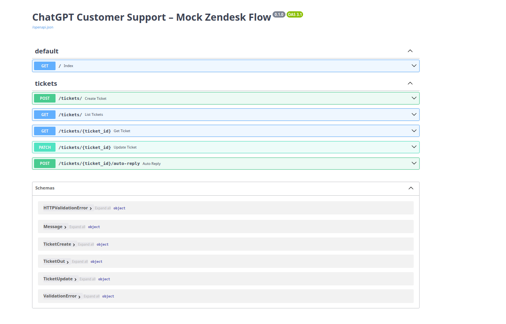
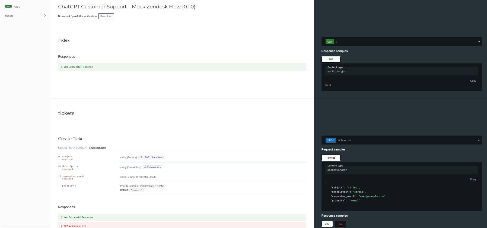
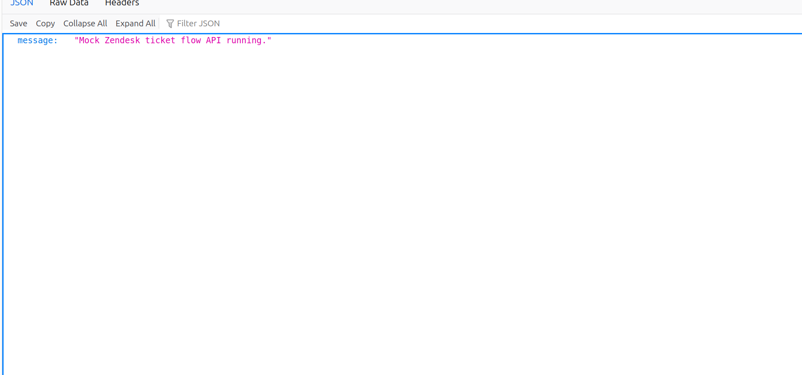

# chatgpt-customer-support-fastapi

Mock Zendesk ticket flow built with FastAPI and SQLite.
- Create/list/get/update tickets
- Simulated agent auto-reply endpoint
- Ready to swap in real Zendesk + LLMs later

## Run
```bash
uvicorn app.main:app --reload --port 8000
Test
pytest -q
Docker
docker build -t cs-fastapi .
docker run -p 8000:8000 cs-fastapi
API Docs
•	Swagger: /docs
•	Redoc: /redoc
```
### (Optional) CI: basic pytest workflow
**.github/workflows/ci.yml**
```yaml
name: ci

on:
  push:
  pull_request:

jobs:
  test:
    runs-on: ubuntu-latest
    steps:
      - uses: actions/checkout@v4
      - uses: actions/setup-python@v5
        with:
          python-version: "3.12"
      - run: pip install -e . pytest
      - run: pytest -q
```

---

## 📸 Screenshots

### 1. ChatGPT Customer Support – Mock Zendesk Flow (Main View)


### 2. ChatGPT Customer Support – Mock Zendesk Flow (Version 0.1.0)


### 3. Mock Zendesk Ticket Flow – API Endpoints


---

Each screenshot demonstrates key areas of the FastAPI project:
- **Image 1:** Overall Swagger UI structure and layout.  
- **Image 2:** Versioned Swagger documentation view (`0.1.0`).  
- **Image 3:** ReDoc interface listing all `/tickets` routes and schemas.
